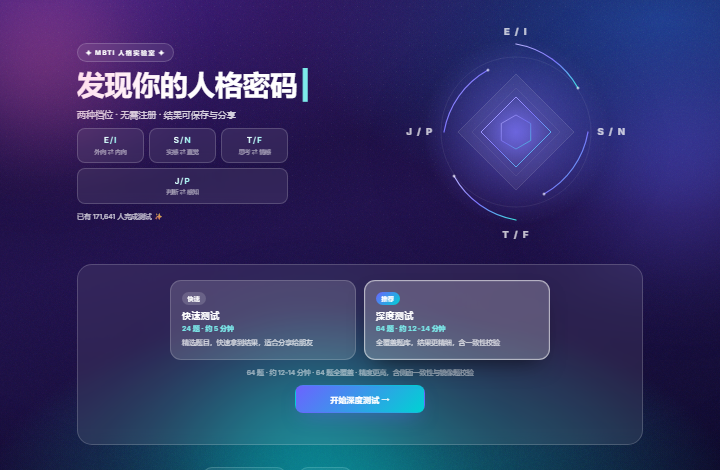
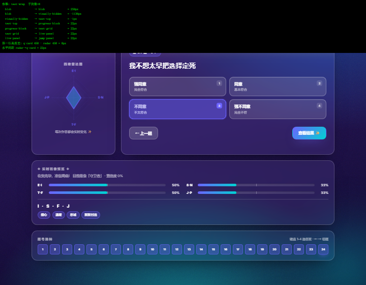
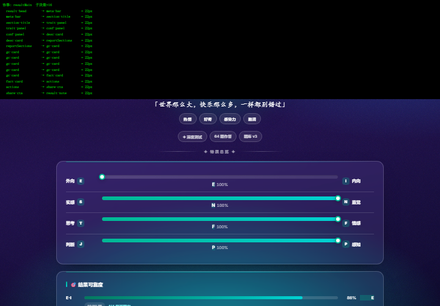

# ✦ MBTI 人格测试

[](https://github.com/shay-Ckm/-mbti-test/actions/workflows/ci.yml)

> 一个纯前端、零依赖的 MBTI 人格测试静态网站：**双档位题库 · 深度测评报告 · 发现你的人格密码**。

🔗 **在线体验**：<https://shay-ckm.github.io/-mbti-test/>

## ✨ 特色

### 双档位题库（同一题库，两种深度）
| 档位 | 题量 | 时长 | 说明 |
|---|---|---|---|
| ⚡ 快速测试 | 24 题 | 约 5 分钟 | 每维 6 题（极性 3:3，覆盖全部 4 个内容侧面），适合快速得到结果与分享 |
| 🎯 深度测试 | 64 题 | 约 12-14 分钟 | 每维 16 题（极性 8:8，每侧面两侧各 2 题），含侧面一致性与 8 组镜像题校验 |

### 测量学设计（v3 题库）
- **强制选择 + 均值差计分**：每题 4 点作答（无中立），分别计算两极题目的均值再取差，
  避免"题目数量不等"或"默认同意"直接变成类型偏差
- **严格配平**：每维 8 : 8、全局 32 : 32；快速档 3 : 3 —— 配平后"一路同意"或"一路不同意"
  都只会被判为**倾向模糊**，而不是硬猜一个类型（有测试覆盖）
- **共享内容侧面（facet）**：每个维度 4 个内容侧面，两侧各有 2 题测同一侧面，
  差值才真正代表"同一构念的两端"；结果显示 4 个侧面是否同向（侧面分歧 = 结果不稳）
- **交织出题**：同维度不再连续成块、同方向不连续出现，削弱顺序与启动效应
- **置信度可解释**：覆盖率 × 题量饱和因子 × 侧面一致度 × 倾向强度（− 镜像题矛盾惩罚），
  所以"快速档天然比深度档不确定"被如实表达，而不是硬压一个低值
- **镜像题一致性**：8 组语义互为镜像的题目，若同时强烈认同则提示作答自相矛盾

### 结果导出（零依赖）
- **人格卡片**：1080×1440 分享图（原生 Canvas 绘制）
- **完整报告长图**：1080×自适应高度，含特质总览/可靠度/优势注意/职业规划/关系社交/压力/更多画像/成长清单/冷知识，**两遍排版**（先测量再绘制）
- **打印 / 存为 PDF**：`@media print` 打印样式（隐藏交互元素、卡片防跨页断开、强制输出颜色），结果页与 16 个类型页均可一键打印

### 准确性优先的测评设计
- **4 点迫选量表**（无中立项），避免中庸作答偏差
- **逐题方向标注**（`dir` 字段），杜绝"奇偶正反向"式的计分错误
- **双侧均值差分计分**：每维分别取两极题目均值再作差，消除题量不平衡偏差
- **逐维置信度**：由覆盖率 × 倾向强度 × 档位因子计算，快速档不会虚报高置信度
- **一致性校验**：镜像配对题若被同时强烈认同/否认，判定为矛盾并降低置信度
- **边界诚实**：倾向模糊的维度显示双字母（如 `E/I`），四维全模糊则进入彩蛋页
- **题库版本化**：`mbti_bank_version` 迁移，题库升级不会误读旧结果

### 丰富的测评报告
类型徽章与专属主题色 · 特质总览双向条 · 结果可靠度 · 关于你 · 优势与注意点（进度条可视化）· 内在驱动力 · 隐藏超能力 / 进阶修炼 · 职业规划（岗位 + 职场风格 + 建议）· 人生指导 · **关系与社交（恋爱/友谊/家庭/职场四场景）** · **压力下的你（信号/反应/修复）** · **更多画像（沟通/团队/学习/金钱）** · **成长清单打卡** · **历史与复测对比** · 冷知识

### 性能与缓存
- **零外部依赖**：无 CDN、无外链字体、无第三方脚本——所有请求都是同源
- **脚本 `defer`**：不再阻塞 HTML 解析；首屏载荷 **≈ 255KB**（含 47KB 本地字体）
- **缓存策略**：Service Worker 版本化缓存（发版时递增 `CACHE_VERSION` 即让用户拿到新资源）+ 静态资源 stale-while-revalidate
- **回归护栏**：静态契约测试持续校验载荷预算（首屏 < 400KB、`script.js` < 130KB、`style.css` < 60KB）、
  无外部资源引用、脚本 defer、以及 **CSS 冗余**（未引用的类名会被测试拦下）

### 无障碍（Accessibility）
- **跳过导航**：每个页面首个可聚焦元素是「跳到主内容」，键盘用户可直达正文
- **语义化**：答题选项为 `radiogroup`/`radio` + `aria-checked`；进度条为 `role="progressbar"` 并实时更新 `aria-valuenow/valuetext`；关系场景为 `tablist`/`tab`/`tabpanel`；矩阵格子有可访问名称
- **动态播报**：题干、实时提示、关系文本为 `aria-live="polite"`，读屏用户能听到变化
- **弹窗**：`role="dialog"` + `aria-modal`，打开时焦点移入、Tab 在弹窗内循环、Esc 关闭并把焦点还给触发按钮
- **对比度**：为四类气质各定义浅底文字色 `--tcolor-ink`（橙色系在白底上从 2.2:1 提到 5.6:1），移除低对比灰 `#9AA3AF`

## 🎨 界面

### 首页


### 答题页


### 结果页


**设计体系（v4）**：深空紫画布（网格纹理 + 光斑 + 暗角）＋ 类型色强调 ＋ 编辑式标题。
- **材质可切换**：答题页与结果页在 `<body>` 上带 `class="theme-glass"`，即采用**半透明玻璃内容面**
  （`rgba(255,255,255,.075)` + 白色描边 + `backdrop-filter`），与首页同一套语言；
  **去掉这个类即回到纸面白卡**——两种风格都只靠一个类名切换，组件规则不变
- 令牌化：颜色/空间/圆角/阴影/动效全部集中在 `:root`，组件只消费令牌
- **统一间距节奏**：所有内容卡片之间只有 `--card-gap`（22px）一个间距；
  答题页第一行两列等高、进度条与计数作为整体（内部 8px）；
  结果页与类型页的每个分区同样是 22px（已用测量脚本逐项核对）
- 层次明确：区块标题带类型色竖轨，卡片顶部一道渐变细轨，列表/编号/胶囊三种信息形态复用
- 首屏即构图：首页为双栏 hero（文案 + 四维罗盘图形）
- 答题页为**原版纵向布局**：雷达图（左）＋ 题卡（右）→ 实时画像预览 → 题号跳转
- 无障碍与稳健：焦点环、跳过导航、`prefers-reduced-motion` 下不做动画且**内容默认可见**

### 传播与 SEO- **16 型百科页**：每型独立静态页（`types/intj.html` 等），含完整档案 + 类型导航 + 回流入口，面向搜索与分享
- **关系匹配矩阵**：`relation.html` 覆盖 16×16 共 256 种组合，给出相似度、互补维度、共同点、容易踩的坑与三条可执行相处建议
- **社交分享卡**：1200×630 OG 图（手写 PNG 生成器）+ `og:*` / `twitter:*` 元信息
- **可安装 PWA + 离线可用**：manifest + 图标，可"添加到主屏"；Service Worker 预缓存外壳，断网也能做题（导航网络优先、资源 stale-while-revalidate）
- **本地字体**：Inter 可变字体 47KB（去掉外部 CDN 与渲染阻塞），中文手写体用系统楷体栈
- **抓取配置**：`robots.txt` + 20 个 URL 的 `sitemap.xml` + 自定义 404

### 交互与体验
打字机开场 · 实时四维雷达图 · 选项滑片指示器 · **题号跳转网格** · **键盘快捷键（1-4 选答、←/→ 切题）** · 阶段里程碑提示 · 页面转场 · 光标辉光 · 噪点纹理 · 分享卡片 PNG · 原生分享（Web Share）· 移动优先响应式 · 尊重 `prefers-reduced-motion`

## 🛠 技术栈

HTML5 + CSS3 + 原生 JavaScript（零框架、零构建、零 npm 依赖，双击即用）

## 📁 文件结构

```
├── index.html            首页（打字机标题 + 双档位选择 + 人数统计）
├── test.html             答题页（进度条 + 实时雷达图 + 实时画像预览 + 题号跳转）
├── result.html           结果页（徽章 + 可靠度 + 完整测评报告 + 成长清单 + 历史）
├── 404.html              自定义 404（复用站点样式，引导回首页/直接测试）
├── relation.html         关系匹配矩阵（16×16 组合 · 相似度/互补/雷区/相处建议）
├── style.css             全部样式（三页共享，含 v2 配色体系）
├── script.js             引擎与页面逻辑（计分 / 渲染 / 交互 / 分享 / 关系匹配 / SW 注册）
├── sw.js                 Service Worker（离线缓存：导航网络优先 + 资源 stale-while-revalidate）
├── data/
│   ├── questions.js      题库 v3：64 题（每维 16 题 = 4 个共享 facet × 2 题/极、8 组镜像题、含快速档 24 题子集）
│   └── profile.js        16 型画像：关系 4 场景 / 压力 3 段 / 沟通·团队·学习·金钱 / 成长清单 6 条
├── types/                16 型百科页（由 tools/make-type-pages.js 生成，面向 SEO）
│   └── intj.html … esfp.html   每型独立档案：特质/优势/职业/关系/压力/成长清单
├── assets/               传播与字体资产
│   ├── og-image.png      社交分享卡 1200×630（由 tools/make-icons.js 生成）
│   ├── icon-192.png / icon-512.png   PWA 图标
│   ├── apple-touch-icon.png         iOS 主屏图标
│   └── fonts/            本地字体（Inter 可变字体 47KB + fonts.css，由 tools/fetch-fonts.js 生成）
├── favicon.svg           站点图标
├── manifest.json         PWA manifest（可添加到主屏）
├── robots.txt / sitemap.xml         搜索引擎抓取配置（sitemap 含 19 个 URL）
├── tools/
│   ├── make-icons.js     零依赖图标/OG 图生成器（Node 内置 zlib 手写 PNG）
│   ├── fetch-fonts.js    字体本地化（拉取 woff2 + 生成本地 @font-face + 内容去重）
│   ├── make-type-pages.js  16 型百科页生成器（同时同步 sitemap.xml）
│   └── push-via-api.js   走 api.github.com 的推送工具（本机 github.com:443 被阻断时使用）
├── mbti-static.test.js   静态契约测试（HTML ↔ JS ↔ CSS ↔ 数据 ↔ 传播资产 ↔ PWA）
├── mbti-logic.test.js    逻辑测试（题库结构、双档位、计分、置信度、一致性、关系引擎、数据完整性）
├── mbti-smoke.test.js    DOM 冒烟测试（最小 DOM stub 跑通页面初始化与关键交互）
├── mbti-sw.test.js       Service Worker 行为测试（离线策略：预缓存/清理/回退/SWR）
├── 项目审计与优化路线图.md  项目审计报告与后续路线图（含上线检查清单）
└── 开发文档.md            完整开发文档（设计理念 / 准确性保障 / 技术方案 / 版本记录）
```

## 🚀 本地运行

双击 `index.html` 即可，无需安装任何东西。

> 数据文件通过普通 `<script>` 顺序加载（不是 ES Module），因此 `file://` 直接打开也能正常工作。

## ✅ 自动化测试（可选，需 Node ≥ 16）

```bash
npm test                     # 一键运行五套测试
npm run test:static          # 静态契约：ID/类名/CSS/数据/传播/PWA/导出/无障碍/性能（206 项）
npm run test:logic           # 逻辑：题库结构 / 双档位 / 计分 / 置信度 / 一致性 / 关系引擎（121 项）
npm run test:psy             # 计分准确率仿真：恢复率 / α / 重测 / 响应定势（28 项）
npm run test:smoke           # DOM 冒烟：页面初始化、关键交互、导出、打印、焦点管理（39 项）
npm run test:sw              # Service Worker 行为：离线策略（18 项）
npm run audit:css            # 额外：扫描 style.css 中未被引用的类名（维护用）
npm run audit:bank           # 额外：题库心理测量审计（结构/侧面/措辞/重复/镜像题）
```

当前共 **412 项断言全部通过**（输出以 `结果：N 通过，0 失败` 结尾）。

### 准确率仿真（模型内，用于发现计分管线问题）
`npm run test:psy` 用已知潜在偏好生成作答再交给真实计分函数，输出可复核的数字：

| 偏好强度 \|θ\| | 深度档逐维准确率 | 深度档四字母全对 | 判为模糊 |
|---|---|---|---|
| 3.0（很明确） | 100% | 100% | 0% |
| 2.0（明确） | 100% | 100% | 0.1% |
| 1.0（中等） | 99.5% | 98.0% | 20.7% |
| 0.5（轻微） | 93.5% | 76.0% | 66.9% |
| 0（无偏好） | 44.3%（≈随机） | 4.7% | **95.6%** |

内部一致性（模型内 Cronbach's α）：深度档 EI/SN/TF/JP ≈ **0.95**，快速档 ≈ **0.88**；
重测一致率：强偏好 100%、弱偏好 75%；即使被试有 35% 的默认同意倾向，逐维准确率仍 99.8% 且无系统性偏移。

> ⚠️ 这是**模型内仿真**，用于验证计分管线（标注、配平、置信度）是否自洽，
> 不能替代真实被试样本的信效度检验——本项目没有常模样本，因此不做"百分位"类宣称。

CI 已在 `.github/workflows/ci.yml` 中配置：每次推送到 `main` 会自动运行三套测试 + 静态资源/HTML 结构检查。

> 测试脚本以最小 DOM stub 在 Node 中运行，因此**不需要** Playwright 等浏览器依赖，也不引入任何 npm 包。

## 🎨 重新生成资产（可选）

```bash
npm run icons                # 重新生成 assets/ 下的 OG 图与图标（零依赖，手写 PNG 编码）
npm run fonts                # 重新拉取本地字体（Inter 可变字体 → assets/fonts/）
npm run types                # 重新生成 16 型百科页 + 同步 sitemap.xml
```

> 类型页内容由 `script.js` 里的类型数据烘焙进静态 HTML（爬虫无需执行 JS 即可读到完整档案），
> 修改类型文案后记得重跑 `npm run types` 以同步 16 个页面。

## 🚢 部署

站点托管在 GitHub Pages：<https://shay-ckm.github.io/-mbti-test/>

**关于推送方式（重要）**：本机网络 **`github.com:443` 不可达**（`git push` 必然失败），
但 `api.github.com:443` 可达。因此本项目附带一个走 REST API 的推送工具：

```bash
npm run push:check           # 只做本地校验 + 构建 tree，不写远端（推荐先跑）
npm run push                 # 校验通过后创建 commit 并更新远端 main
npm run verify               # 部署后验收：tree/文件字节一致性 + CI 状态 + Pages 构建 + 线上内容标记
```

工具的安全设计：① 逐文件校验工作区字节与已提交内容一致；② 每个文件先经 Blobs API 上传并**逐个比对 blob SHA**，
再生成 tree，且 **tree SHA 必须与本地 HEAD 的 tree 完全一致**，否则中止——**内容不对就绝不写入远端**。
凭据优先读 `GH_TOKEN` 环境变量，否则从 git 凭据管理器获取（不会打印）。

推送成功后：GitHub Actions 自动跑 CI，Pages 自动重新构建（约 1-2 分钟），随后用 `npm run verify` 核对线上。

> 如果你的网络能直连 `github.com`，也可以直接用 `git push`；注意本仓库已设置 `core.autocrlf=false` 以避免行尾差异。

## 📌 内容与数据说明

- 题库与画像文案为自制内容，**非标准化心理量表**，不用于临床或人事决策
- 类型名称沿用公众通行译名，与任何官方机构无关
- 代码以 MIT 许可开源（见 `LICENSE`）

## ⚠️ 说明

MBTI 是偏好参考，不是科学判刑；人格是流动的，别让标签定义你 😉
